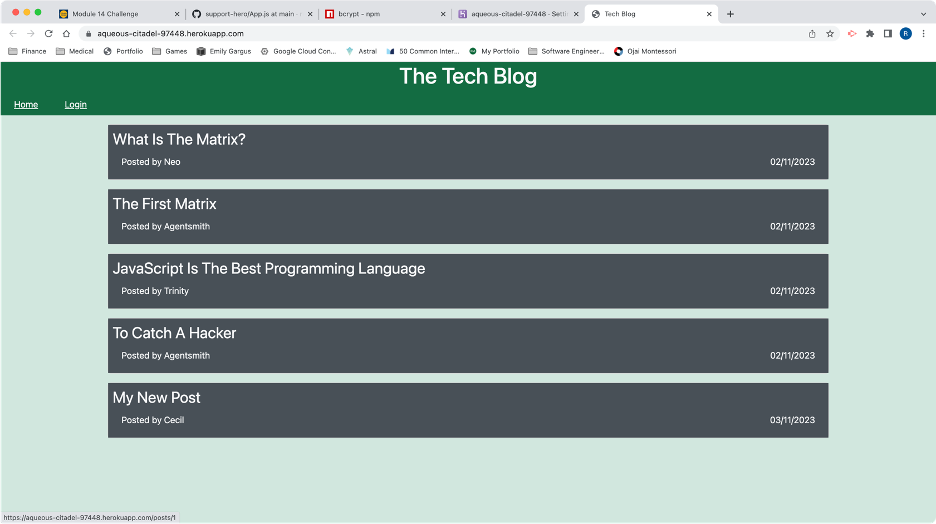
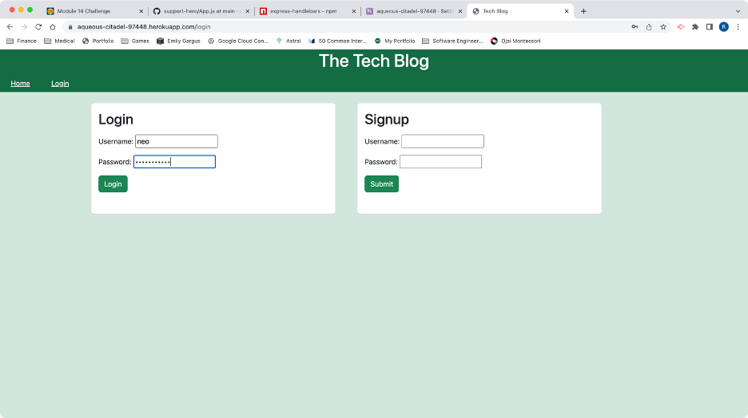
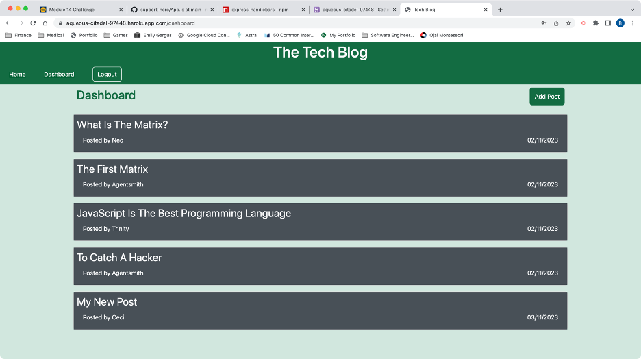
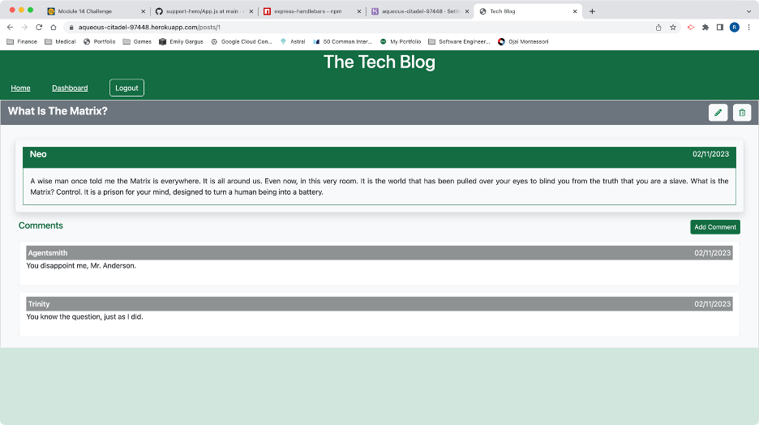
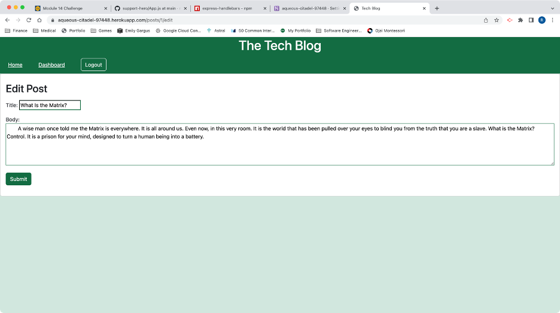

# Tech Blog

## Technology Used 

| Technology Used    |                                                    Resource URL                                                    |
| ------------------ | :----------------------------------------------------------------------------------------------------------------: |
| JavaScript         | [https://developer.mozilla.org/en-US/docs/Web/JavaScript](https://developer.mozilla.org/en-US/docs/Web/JavaScript) |
| Express            |                                  [https://expressjs.com/](https://expressjs.com/)                                  |
| Express-Handlebars |        [https://www.npmjs.com/package/express-handlebars](https://www.npmjs.com/package/express-handlebars)        |
| MySQL              |                                  [https://www.mysql.com/](https://www.mysql.com/)                                  |
| Sequelize          |                                  [https://sequelize.org/](https://sequelize.org/)                                  |
| Bcrypt             |                    [https://www.npmjs.com/package/bcrypt](https://www.npmjs.com/package/bcrypt)                    |

<br/>

## Table of Contents
- [Technology Used](#technology-used)
- [Table of Contents](#table-of-contents)
- [Description](#description)
- [Code Example](#code-example)
- [Usage](#usage)
- [Learning Points](#learning-points)
- [Author Info](#author-info)
  - [Ryan Moscoe](#ryan-moscoe)
- [License](#license)

<br/>

## Description 

[Visit the Deployed Site](https://aqueous-citadel-97448.herokuapp.com/)

This full-stack application offers a simplified blog service. It includes user registration and authentication functionality and allows users to create blog posts and comment on any user's posts. Users can also edit or delete their own blog posts and comments. To accomplish this, the application renders views using Express-Handlebars, relies on Express for routing, and stores data in a MySQL database.

<br/>



<br/>

## Code Example

This project did not include any starter code. Several elements of the code for this application are noteworthy, such as the embedding of Bcrypt methods within hooks on the user model in the database, as well as the code to handle routing. Perhaps the most interesting aspect of this project is the use of Handlebars to conditionally render elements and embed data in those elements based on values passed from the server. For example, the code snipet below demonstrates rendering edit and delete buttons only if the user is the author of the comment and then attaching the comment ID to the buttons so the event handlers can make use of that information.


```html
    {{#if author}}
        <div class="my-0">
            <button data-comment="{{id}}" class="btn btn-sm btn-light mx-2">
                <i class="text-success fa-solid fa-pencil"></i>
            </button>
            <button data-comment="{{id}}" class="btn btn-sm btn-light">
                <i class="text-success fa-regular fa-trash-can"></i>
            </button>
        </div>
    {{/if}}
```

<br/>

## Usage 

The homepage shows a list of blog posts. In order to view the details of a post, create or modify a post, or do anything with comments, a user must log in. Attempting to click on a blog post when not logged in reroutes to the login page (shown below).

<br/>



<br/>

Upon signing up or logging in, the user sees a dashboard that is similar to the homepage but allows the user to create a post or view the details of a post.



<br/>

The post details page shows the text of the post and any attached comments. If the user is the author of the post, edit and delete buttons are rendered at the top of the page. Similarly, edit and delete buttons are rendered for any comments created by the user. The user also has the option to add a comment.

<br/>



<br/>

Posts and comments each use a single form component for both creation and editing. When editng, Handlebars renders the existing data in the form.

<br/>



<br/>

## Learning Points 

This project gave me an opportunity to learn several concepts and skills:
* The Model-View-Controller (MVC) paradigm
* User authentication using Bcrypt
* Dynamic rendering using Express-Handlebars
* Passing data among pages in the application using Express-Handlebars

<br/>

## Author Info

### Ryan Moscoe 

* [Portfolio](https://rmoscoe.github.io/my-portfolio/)
* [LinkedIn](https://www.linkedin.com/in/ryan-moscoe-8652973/)
* [Github](https://github.com/rmoscoe)

<br/>

## License

See repo for license information.
